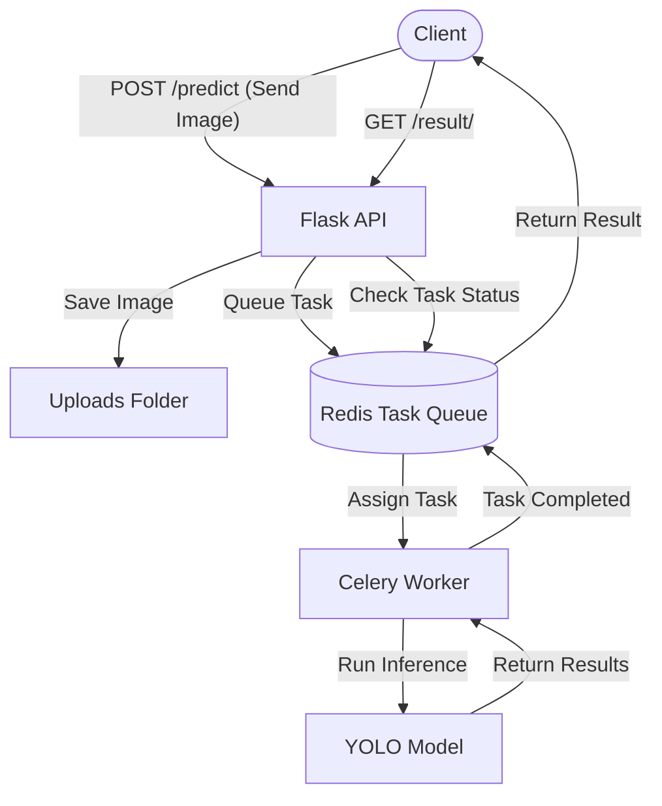

# Scalable Image Inference API

This project is a Python-based scalable image inference API that uses a pre-trained object detection model (e.g., YOLOv5/YOLOv8) to perform inference on images. The API is built using Flask, Celery for background task management, and Redis as a message broker. It is containerized using Docker and designed to handle multiple concurrent requests efficiently.

## Features

- RESTful API to accept image files and return object detection results.
- Background task processing using Celery and Redis.
- Supports concurrent request handling with scalable task queue management.
- Object detection using YOLOv5/YOLOv8 pre-trained models.
- Dockerized for easy deployment and scalability.

## Table of Contents

- [Scalable Image Inference API](#scalable-image-inference-api)
  - [Features](#features)
  - [Table of Contents](#table-of-contents)
  - [Requirements](#requirements)
  - [Installation](#installation)
  - [Usage](#usage)
  - [Endpoints](#endpoints)
  - [Technologies](#technologies)
  - [Architecture](#architecture)
    - [System Diagram](#system-diagram)
  - [License](#license)

## Requirements

- Python 3.9+
- Docker & Docker Compose
- Redis

## Installation

1. **Clone the repository**:

   ```bash
   git clone https://github.com/your-username/scalable-image-inference-api.git
   cd scalable-image-inference-api
   ```

2. **Set up environment variables**:
   Create a `.env` file in the project root and add the following environment variables:

   ```bash
   BROKER_URL=redis://redis:6379/0
   BACKEND_URL=redis://redis:6379/0
   ```

3. **Install dependencies using Docker**:

   Build and run the Docker containers using Docker Compose:

   ```bash
   docker-compose build
   docker-compose up
   ```

4. **Install dependencies without Docker** (if not using Docker):
   Install Python dependencies:

   ```bash
   pip install -r requirements.txt
   ```

   Start Redis:

   ```bash
   redis-server
   ```

5. **Ensure Uploads Folder Exists**:
   Make sure the `uploads/` folder exists in the project directory, or create it:

   ```bash
   mkdir uploads
   ```

## Usage

You can use the API to submit images for object detection and retrieve the results after processing.

1. **Send an image for object detection**:
   Use a tool like Postman, cURL, or any HTTP client to send an image.

   Example using cURL:

   ```bash
   curl -X POST http://localhost:5000/predict         -F "image=@/path/to/your/image.jpg"
   ```

   The response will contain a `task_id` that you can use to retrieve the result.

2. **Check the result of the task**:

   Example using cURL:

   ```bash
   curl http://localhost:5000/result/<task_id>
   ```

   Replace `<task_id>` with the actual task ID from the `/predict` response.

## Endpoints

- **POST /predict**: Accepts an image file and queues a task for object detection. Returns a task ID.
  
  - **Request Body**: 
    - `image`: An image file in `.jpg`, `.jpeg`, or `.png` format.
  
  - **Response**: 
    - `task_id`: The ID of the task that can be used to check the result.

- **GET /result/<task_id>**: Retrieves the result of the object detection task.

  - **Response**:
    - `status`: The status of the task (`PENDING`, `SUCCESS`, `FAILURE`).
    - `result`: The object detection result if the task was successful, or an error message if it failed.

## Technologies

- **Python**: The core programming language.
- **Flask**: API framework to handle HTTP requests.
- **Celery**: Task queue for managing background processing.
- **Redis**: Message broker for Celery.
- **YOLOv5/YOLOv8**: Object detection model for inference.
- **Docker**: Containerization for easy deployment and scalability.

## Architecture

1. **Client**: Sends an image to the API for object detection.
2. **Flask API**: Handles incoming HTTP requests and saves the image.
3. **Redis**: Manages the task queue and assigns tasks to workers.
4. **Celery Worker**: Processes the image in the background using the YOLO model.
5. **YOLO Model**: Performs object detection on the submitted image.
6. **Redis**: Stores the result, which can be retrieved by the client via a task ID.

### System Diagram



## License

This project is licensed under the MIT License.

